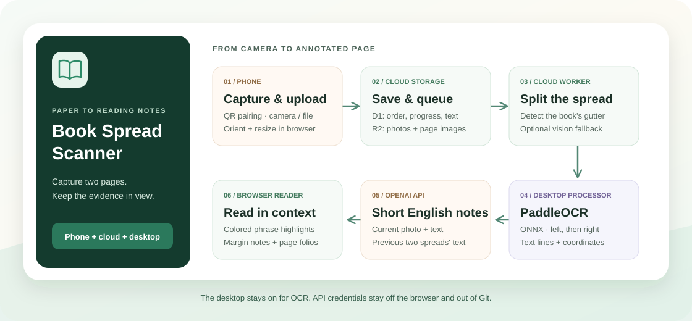

<h1 align="center">Book Spread Scanner</h1>

<p align="center">Turn an open book into an annotated reading view.<br/>Capture with your phone. Extract text on your computer. Read short English notes beside the original page.</p>

<p align="center">
  <strong>English</strong> · <a href="README.zh-CN.md">简体中文</a> ·
  <a href="#why-this-exists">Why This Exists</a> ·
  <a href="#features">Features</a> · <a href="#quickstart">Quickstart</a>
</p>

<p align="center">
  
  
  
</p>

<p align="center">
  
</p>

The web app saves photos and queues work; a **separate desktop processor** handles OCR and requests AI annotations. The processor's computer must remain awake and connected. The interface is primarily in Simplified Chinese, while generated reading notes are in English.

## Why This Exists

A photo preserves a book page, but reading from a pile of photos is awkward. A passage may cross the gutter, the next sentence may continue onto another capture, and a note detached from its source is hard to trust.

Book Spread Scanner brings those pieces together. Photograph both pages at once, keep captures in reading order, and review short notes on the original image. OCR supplies the text and its location; the model supplies a concise observation tied to a quoted phrase. The previous two spreads provide context without turning every request into an upload of the entire book.

The workflow also separates capture from processing. After a photo uploads, you can take another or close the phone page. The durable queue and desktop processor continue the work, and the reader shows results when they are ready.

## Features

| Capability | What it does |
| --- | --- |
| Phone-to-desktop capture | Pair with a session QR code; use the system camera or a photo picker, then upload the confirmed image |
| Two-page splitting | Detect the book's gutter, separate left and right pages, and manually adjust an incorrect split |
| Desktop OCR | Run Guten OCR / PaddleOCR PP-OCRv4 through native ONNX Runtime, left page before right page |
| Context-aware reading notes | Use the current photo and text plus the previous two spreads' text from the same session |
| Short English annotations | Aim for 2–4 distinct notes per spread, each at most 10 words, anchored to source phrases |
| Visual evidence | Match colored phrase highlights to margin notes and connecting lines; retain the original uploaded image |
| Printed page numbers | Read visible folios from the image; show unknown values instead of guessing from capture order |
| Durable processing | Persist the queue and progress, recover expired task leases, and display processor-offline status |
| Targeted corrections | Re-split and reprocess a photo, retry a failed task, or regenerate only annotations while keeping existing OCR |
| Long-session navigation | Use a filmstrip, keyboard navigation, lightweight progress polling, and lazy thumbnails |

### Technical flow

1. **Capture:** the browser normalizes orientation and resizes the upload to at most 2,400 pixels on its long edge and 3.8 megapixels. The saved original is this upload image, not the untouched camera file.
2. **Save and split:** Cloudflare D1 stores session order, revisions, text, and task state; R2 stores images. A Worker detects the gutter, with optional OpenAI vision assistance when local confidence is low.
3. **Recognize:** the desktop processor claims queued work and runs OCR. Detected line quadrilaterals remain the source of text coordinates.
4. **Annotate:** OpenAI receives the current photo, current text, and the previous two spreads' text. Returned evidence is validated against current-page text; highlight coordinates come from OCR.
5. **Review:** the browser displays the annotated image, printed page numbers, and processing state. Version checks prevent old results from overwriting a revised split.

Phrase boundaries are estimated within OCR line geometry; they are not pixel-perfect character detection. Glare, blur, steep angles, and complex columns can reduce quality. Full perspective correction, curved-page flattening, and automatic page turning are not implemented. Unreadable pages can produce no notes; invalid results are surfaced for retry.

## Quickstart

### 1. Install and configure

Use **Node.js 22.13 or newer**, npm, and Git. The commands below use PowerShell.

```powershell
git clone https://github.com/Ha22yX/book-spread-scanner.git
cd book-spread-scanner
npm ci
Copy-Item .env.example .dev.vars
```

Edit `.dev.vars` locally before continuing:

| Variable | Configuration |
| --- | --- |
| `OPENAI_API_KEY` | Your OpenAI API key; AI annotation and optional vision requests incur API usage charges |
| `OPENAI_MODEL` | The example and code default to `gpt-5.6-sol`; use a model available to your account that supports the image and structured-output requests in this project |
| `PROCESSOR_TOKEN` | A long random secret shared by the web service and desktop processor |
| `PROCESSOR_BASE_URL` | `http://127.0.0.1:3000` for local use; the HTTPS site URL for a remote deployment |
| `SITE_ACCESS_TOKEN` | Needed by the processor when connecting to an access-restricted `*.chatgpt.site` deployment; leave empty for localhost |

Generate a processor token locally with `node -e "console.log(require('node:crypto').randomBytes(32).toString('hex'))"` and paste it into `.dev.vars`. Real credentials belong in ignored local files or your hosting provider's secret store. `.env.example` contains empty credential fields.

### 2. Start the web app and processor

In the first terminal:

```powershell
npm run db:migrate
npm run dev
```

In a second terminal, from the same project directory:

```powershell
npm run processor
```

Open **[localhost:3000](http://localhost:3000/)**. Both processes are needed for the automatic local workflow. The processor supervisor restarts a failed OCR child; it cannot process anything while the computer is shut down or asleep.

### 3. Capture and read

1. Open a session on the computer and select **手机拍摄** to show its QR code.
2. Open the capture page on your phone, take a photo, and confirm it in the system camera. You can also choose an existing image.
3. Follow the stages on the computer: queued → split → left OCR → right OCR → context → annotations.
4. Read the highlights and margin notes; adjust the split or retry only if needed.

A phone cannot reach your computer through a `localhost` URL. For local-network use, set `PROCESSOR_BASE_URL` to `http://127.0.0.1:3000`, stop the two development processes, then run:

```powershell
npm run build
npm run lan
```

This starts both the web service and OCR processor. Open `http://YOUR_COMPUTER_LAN_IP:3000/` on your computer to create a phone-reachable QR link, and connect the phone to the same network. Live camera preview requires HTTPS except on localhost; use the photo picker on ordinary LAN HTTP. For remote capture, use an authenticated HTTPS deployment.

### Hosting, privacy, and development

- **Hosting:** the current architecture uses a Cloudflare Worker, D1, and R2, with Sites integration. `.openai/hosting.json` identifies the existing deployment; configure your own project and bindings for a separate deployment. Publishing this source does not make the running site public.
- **Data:** a remote deployment stores uploaded photos, OCR, and annotations in its configured cloud storage. OpenAI receives the image and text described above. OCR runs on the processor computer; this is not a fully offline workflow.
- **Access:** session links act as access capabilities. Keep them private and protect a remote site with authentication. `PROCESSOR_TOKEN` protects the processor endpoint, not every reader or upload route.
- **Checks:** run `npm run typecheck`, `npm test`, and `npm run build`. Integration scripts using AI make real API calls; see the [development and operations notes](docs/operations.zh-CN.md).
- **Windows background service:** optional sign-in startup, recovery behavior, and annotation-only regeneration are documented in those same notes.
- **Credential review:** see the [publication security notes](docs/security.md) for scan scope and credential handling.
- **Third-party assets:** OCR models and runtimes retain their notices in [public/ocr/NOTICE.txt](public/ocr/NOTICE.txt). No repository-wide license file has been added.
